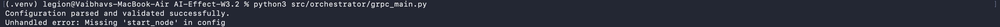

# Issue Log – WP 3.2 Orchestrator

## Summary
This document tracks the key technical challenges encountered and resolved during the development of the WP 3.2 orchestrator. The issues are grouped into three main phases: initial Docker/Subprocess setup, the transition to gRPC, and the final stabilization and code cleanup.

---

## Phase 1: Initial Docker & Subprocess Setup

This phase focused on getting the initial proof-of-concept orchestrator running with Docker Compose and executing WP 3.1 containers via `docker run`.

- **Issue: Docker Environment & Permissions**
  - **Problem:** `docker-compose: command not found` and `PermissionError` when accessing the Docker socket.
  - **Resolution:** Installed Docker Compose and added the current user to the `docker` group to grant necessary permissions.

- **Issue: Docker Build Context Errors**
  - **Problem:** Docker builds failed due to `COPY failed: forbidden path outside the build context`. The Dockerfile was trying to access files outside the directory specified in `docker-compose.yml`.
  - **Resolution:** Corrected the `build.context` path in `docker-compose.yml` to include the project root, and updated the `COPY` paths in the Dockerfile accordingly.

- **Issue: File Handoff & Volume Mounts**
  - **Problem:** Containers were failing with `FileNotFoundError` because the input files (e.g., `energy_data.csv`) were not available inside the container's filesystem.
  - **Resolution:** Updated the orchestrator's configuration (`energy-pipeline.json`) to include the correct `-v /path/to/data:/data` flag in each container's `command` string, ensuring the shared data volume was mounted correctly during execution.

---

## Phase 2: Transition to gRPC Architecture

This phase involved refactoring the orchestrator into a gRPC client and resolving the challenges related to Protobuf compilation and Python imports.

- **Issue: Python `ModuleNotFoundError` for `proto` package**
  - **Problem:** When running the new gRPC scripts, Python could not find the `proto` module because the project's root directory was not on the Python import path.
  - **Resolution:** Added a standard Python workaround at the top of the main scripts to prepend the project's root directory to `sys.path`, allowing for clean, absolute imports (e.g., `from proto import ...`).

- **Issue: Protobuf Compilation and Import Errors**
  - **Problem:** The auto-generated gRPC Python files (`pb2.py` and `pb2_grpc.py`) had incorrect relative imports, causing `ImportError`. Additionally, the initial compilation command placed the files in the wrong directory.
  - **Resolution:**
    1.  Corrected the `protoc` compilation command to specify `proto/` as the output directory.
    2.  Added an `__init__.py` file to the `proto/` directory to mark it as a Python package.
    3.  Manually adjusted the generated files to use correct relative imports (e.g., `from . import energy_pipeline_pb2`).

- **Issue: Local macOS Environment Setup**
  - **Problem:** Running the application on a new machine (macOS) revealed several environment-specific issues, including a `Read-only file system` error when creating logs and missing gRPC packages.
  - **Resolution:**
    1.  Updated the logging directory to be a relative path (`logs/`) within the project instead of an absolute system path (`/logs`).
    2.  Updated the config file path to also be a relative path (`config/energy-pipeline.json`).
    3.  Documented the need to install `grpcio` and `grpcio-tools` from `requirements.txt` in the virtual environment.

---

## Phase 3: Final Stabilization & Code Cleanup

This phase addressed the final bugs found after implementing the core mentor feedback.

- **Issue: `Missing 'start_node' in config`**
  - **Problem:** The orchestrator was failing on startup. The `grpc_main.py` script was only passing the `containers` dictionary to the `execute_workflow` function, not the entire configuration object.
  - **Resolution:** Corrected the function call in `grpc_main.py` to pass the full `config` object, giving the executor access to `start_node`, `service_registry`, and `containers`.
  

- **Issue: Virtual Environment Files in Git**
  - **Problem:** The `.venv` directory was accidentally being tracked by Git.
  - **Resolution:** Added `.venv/` to the `.gitignore` file and removed the directory from the Git cache using `git rm -r --cached .venv/`.

### Final Outcome
All known issues have been successfully resolved. The orchestrator is stable, runs on different platforms with a reproducible environment, and correctly implements the required gRPC architecture.

---
---


## Issue Log – WP3.2 Orchestrator Setup

This document tracks all issues encountered during initial Docker setup and orchestration scaffolding for WP3.2.

---

### Issue 1: `docker-compose: command not found`

- **Summary:** Docker Compose was not pre-installed on the system.
- **Resolution:**
  Installed Docker Compose using APT:
  ```bash
  sudo apt install docker-compose
  ```

---

### Issue 2: `PermissionError(13)` — Docker socket access denied

- **Summary:** The orchestrator container exited due to lack of permission to access the Docker daemon socket (`/var/run/docker.sock`).
- **Resolution:**
  Added user to the `docker` group:
  ```bash
  sudo usermod -aG docker $USER
  ```
  Then logged out and back in (or rebooted) to apply the group membership.

---

### Issue 3: `COPY failed: forbidden path outside the build context`

- **Summary:** Dockerfile used a `COPY` command referencing a path (`../../src/...`) outside of the Docker build context.
- **Resolution:**
  - Modified the `docker-compose.yml` to expand the build context:
    ```yaml
    build:
      context: ../
      dockerfile: docker/orchestrator/Dockerfile
    ```
  - Adjusted the Dockerfile `COPY` path accordingly:
    ```dockerfile
    COPY src/orchestrator/requirements.txt .
    ```

---

### Issue 4: `lstat .../orchestrator: no such file or directory`

- **Summary:** Docker build failed due to an incorrect Dockerfile path in `docker-compose.yml`.
- **Resolution:**
  Verified that the Dockerfile exists at `docker/orchestrator/Dockerfile` and corrected the reference:
  ```yaml
  dockerfile: docker/orchestrator/Dockerfile
  ```

---

### Outcome

All issues were resolved. The orchestrator container now:
- Builds successfully with Docker and Compose
- Executes `main.py` from the mounted volume
- Is ready for the next development stage (workflow execution, testing, and integration)

---

### Issue 5: `FileNotFoundError: /data/energy_data.csv`

- **Summary:** When running the orchestrator from WP3.2, the generator container failed due to missing input file.
- **Root Cause:** The orchestrator runs containers with `docker run` that expect volume-mounted files in `/data/`, but the mount path was missing.
- **Resolution:**
  - Updated the `config/energy-pipeline.json` to inject absolute volume paths into the `command` field:
    ```json
    "command": "docker run -v /home/work/project/AIEffect-3.1-to-3.2/data:/data aieffect-31-to-32-energy-generator"
    ```
  - Applied same for analyzer and report-generator.
  - Ensured `data/energy_data.csv` was generated beforehand.

---

### Issue 6: Output files not found during orchestrator execution

- **Summary:** Analyzer and report-generator containers failed because their expected input files (`output1.json`, `output2.json`) were missing.
- **Root Cause:** Volumes were mounted but generator had failed earlier due to CSV file not found, resulting in empty pipeline flow.
- **Resolution:**
  - Verified file presence in `/data/`
  - Manually tested each container using:
    ```bash
    docker run --rm -v "$PWD/data:/data" <container-name>
    ```
  - Confirmed successful handoff and updated orchestrator mount paths.

---

### Issue 7: `ModuleNotFoundError: No module named 'proto'`

- **Summary:** Attempting to run `dummy_grpc_server.py` failed because Python couldn’t locate the `proto` package.
- **Root Cause:** The project root was not included in the Python import path.
- **Resolution:**
  - Prepended the root directory to `sys.path` at the top of `dummy_grpc_server.py`:
    ```python
    import sys, os
    sys.path.insert(0, os.path.abspath(os.path.join(os.path.dirname(__file__), "../../")))
    ```

---

### Issue 8: `ImportError: cannot import name 'energy_pipeline_pb2' from 'proto'`

- **Summary:** Even after adjusting import paths, Python raised an import error from `proto/__init__.py`.
- **Root Cause:** The `energy_pipeline_pb2_grpc.py` used a relative import that expected `energy_pipeline_pb2` to be a sibling module.
- **Resolution:**
  - Modified `energy_pipeline_pb2` generated file to use relative imports:
    ```python
    # in energy_pipeline_pb2_grpc.py
    from . import energy_pipeline_pb2 as energy__pipeline__pb2
    ```

---

### Issue 9: gRPC proto generation targeting wrong folder

- **Summary:** Initial compilation of `.proto` placed generated files in `src/orchestrator/` instead of `proto/`.
- **Resolution:**
  - Regenerated files using:
    ```bash
    python3 -m grpc_tools.protoc \
      --proto_path=proto \
      --python_out=proto \
      --grpc_python_out=proto \
      proto/energy_pipeline.proto
    ```
  - Verified files appeared in `proto/` and updated all imports in client/server files.

---

### Issue 10: Dummy gRPC server not connecting to protobuf modules

- **Summary:** Running `dummy_grpc_server.py` still failed with:
  `ModuleNotFoundError: No module named 'energy_pipeline_pb2'`
- **Root Cause:** Generated code was not using relative imports, and Python couldn't resolve them in nested directories.
- **Resolution:**
  - Manually edited:
    - `energy_pipeline_pb2_grpc.py`
    - `energy_pipeline_pb2.py`
  - Ensured all relative imports used dot notation from `proto`:
    ```python
    from . import energy_pipeline_pb2
    ```

---

### Issue 11: `.venv` files mistakenly added to Git

- **Summary:** Executing `git add .` included the virtual environment directory.
- **Resolution:**
  - Updated `.gitignore` to include:
    ```
    .venv/
    ```
  - Removed all staged `.venv` files:
    ```bash
    git reset
    git rm -r --cached .venv/
    ```

---

### Outcome

All gRPC-related issues were successfully resolved. Dummy server now launches cleanly and is ready for testing with the gRPC-enabled orchestrator (`grpc_main.py`). Imports are stable, and `.proto` compilation is fully automated and reproducible.

---

### Issue 12: `OSError: [Errno 30] Read-only file system: '/logs'` on macOS

- **Summary:** Running `grpc_main.py` failed due to attempt to create logs at `/logs`, which is not writable on macOS.
- **Root Cause:** The default `LOG_DIR` was hardcoded as `/logs`, a system directory.
- **Resolution:**
  - Changed default `LOG_DIR` in `grpc_main.py` to `logs/` in local project root:
    ```python
    LOG_DIR = os.environ.get("LOG_DIR", "logs")
    ```

---

### Issue 13: `Config file not found: /config/energy-pipeline.json` on fresh machine

- **Summary:** gRPC orchestrator failed because `config/energy-pipeline.json` wasn't found.
- **Root Cause:** The path was Docker-specific (`/config/`) and not valid on the host.
- **Resolution:**
  - Updated `grpc_main.py` to look for config at a relative path:
    ```python
    config = parse_config("config/energy-pipeline.json")
    ```

---

### Issue 14: `ModuleNotFoundError: No module named 'grpc'`

- **Summary:** Python raised an import error when attempting to run `grpc_main.py` after setting up the virtual environment.
- **Resolution:**
  - Installed `grpcio` and `grpcio-tools` in the `.venv`:
    ```bash
    pip install grpcio grpcio-tools
    ```

---

### Outcome

The gRPC orchestrator now runs fully on macOS:
- Dummy server and gRPC pipeline tested successfully.
- Logs are created in the project folder.
- Local configuration works outside Docker.
- Environment reproducible with proper setup instructions.


