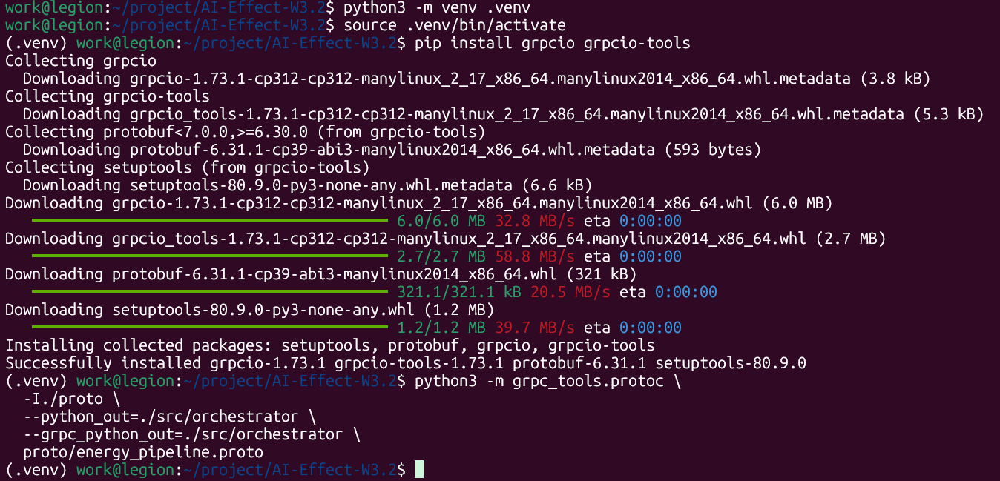
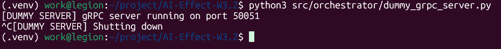
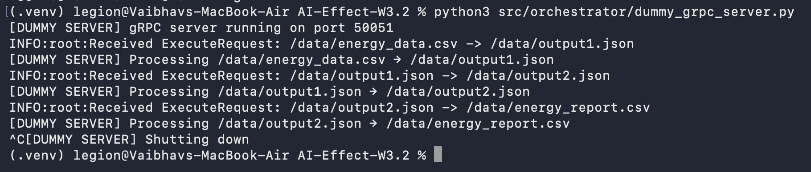
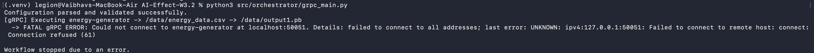

# WP 3.2 - Orchestrator Handover Document

## Final Architecture Summary

This document details the final, working implementation of the WP 3.2 orchestrator. The project successfully transitioned from a Docker-based subprocess executor to a pure gRPC client, fulfilling all Phase 2 requirements.

The final architecture is a service-oriented model where this orchestrator (WP 3.2) acts as the central controller, making gRPC calls to a set of persistent services. After discovering a critical architectural mismatch in the provided WP 3.1 services, a corrected, self-contained version of the services was salvaged and integrated into this project to create a fully demonstrable, end-to-end pipeline.

### Key Features of the Final Implementation:
- **gRPC Client-Only:** The orchestrator does not run Docker commands. It communicates with backend services via gRPC.
- **Configuration-Driven Workflow:** The execution flow is determined by `start_node` and `next_node` properties in a central JSON configuration file.
- **Dynamic Service Discovery:** The orchestrator connects to the correct service for each step by looking up its address in the `service_registry`.
- **Robust Validation:** The application validates its configuration on startup and fails fast if required fields are missing or empty.
- **Self-Contained Backend:** The project includes a `wp31_services` directory and a `docker-compose.yaml` file, which allows the entire, corrected backend pipeline to be run with a single command for demonstration and testing.

---

## How to Run the Full Pipeline

**Prerequisites:**
1. Docker and Docker Compose must be installed and running.
2. A Python virtual environment with the required packages installed.

**Execution Steps:**

1.  **Start the Backend Services (Terminal 1):**  
    From the project root directory, run the following command. This will build and start the corrected gRPC services.
    
        docker-compose up --build
    
    Leave this terminal running.

2.  **Run the Orchestrator (Terminal 2):**  
    Open a new terminal. From the project root, activate the virtual environment and run the main script.
    
        source .venv/bin/activate
        python3 src/orchestrator/grpc_main.py
    
    This will trigger the successful end-to-end run of the pipeline.

---

## Key Artifacts in This Repository

- **Orchestrator Application Logic:**
  - `src/orchestrator/grpc_main.py`: The entry point for the application.
  - `src/orchestrator/grpc_executor.py`: Contains the core workflow and gRPC client logic.
  - `src/orchestrator/config_parser.py`: Handles loading and validation of the config file.
- **Orchestration Configuration:**
  - `config/energy-pipeline.json`: The central file defining the workflow, service locations, and file paths.
- **Self-Contained Backend Services:**
  - `wp31_services/`: A directory containing all the salvaged and corrected code for the WP 3.1 services.
  - `docker-compose.yaml`: The master file to build and run the backend services.
- **gRPC Contract:**
  - `wp31_services/proto/energy_pipeline.proto`: The corrected, official blueprint for gRPC communication.
- **Run Logs:**
  - `logs/orchestrator.log`: Contains detailed logs of the orchestrator's execution flow.

---

## Appendix: Original Project Documentation, Learning Summaries, and Historical Logs

*(This section contains the original, detailed project logs and notes for historical context.)*

### Stage 3: End-to-End Integration Test (Phase 1)

**Objective:**  
To verify that the WP 3.2 orchestrator can successfully execute and manage the complete WP 3.1 pipeline using configuration-driven commands.

**Actions Taken:**
- Ensured WP 3.1 repository containers were working and built.
- Generated a new `energy_data.csv` file with valid synthetic data.
- Launched the orchestrator using:
    
        docker-compose run --rm orchestrator python main.py
    
  Observed sequential execution and verified correctness of each intermediate and final output.

---

### Stage 3: Execution from 3.1 Orchestrator (Phase 1)

**Objective:**  
To confirm that the orchestrator in WP 3.2 correctly triggers WP 3.1 containers with volume-mounted data handoff.

**Execution:**

    docker-compose run --rm orchestrator python main.py

**Verified:** Logs confirmed outputs in the mounted data folder.

**Limitations (Phase 1):**
- Communication was file-based, not service-based.
- `docker run` executed inside containers, no APIs/IPC.
- No health checks or retries.
- Logs were console-only, no structured tracing.

---

### Learning Summary (By Student)

**What I Learned About Containers:**
- How to build/tag multi-service Docker containers.
- How docker-compose links volumes and networks.
- How to mount shared folders for passing outputs.

**What Broke and Fixes:**
- Incorrect volume paths → fixed.
- Bad COPY instructions → corrected Docker context.
- Permission issues → used `sudo` for file generation.
- Missing images → pre-built required ones.

**Orchestrator Sequencing:**
- Parsed config JSON.
- Ran Docker containers serially with `subprocess.run()`.
- Verified execution order through logs.

---

### Iteration 2: gRPC-based Orchestration Setup

**Objective:** Refactor to gRPC communication.  

**Actions Taken:**
- Defined `energy_pipeline.proto`.
- Generated Python gRPC modules.
- Built `grpc_executor.py` and `grpc_main.py`.
- Created `dummy_grpc_server.py` for isolated testing.

**Outcome:**  
gRPC communication between orchestrator and dummy backend confirmed.

---

### gRPC Local Testing on macOS – July 12

- Cloned repo, setup virtual environment.
- Fixed path/import issues.
- Ran `dummy_grpc_server.py` and `grpc_main.py`.
- Verified orchestrator execution flow via gRPC.

**Outcome:** Confirmed orchestrator works via gRPC on macOS host.

---

### Critical Fixes – Phase 2 Week 1

**Decisions & Fixes:**
1. Fail-fast on invalid config → no silent recovery.
2. Execution flow follows `next_node` chain → cycle detection added.
3. No hardcoded paths → gRPC requests use config paths.
4. Logging improvements in `grpc_main.py`.

---

### Historical Screenshots

- Orchestrator command run:
  

- Orchestrator success trace:
  

- gRPC Protobuf structure:
  

- gRPC Dummy Server validation:
  

- gRPC Dummy Client execution:
  

- Final "Connection Refused" test (client works):
  