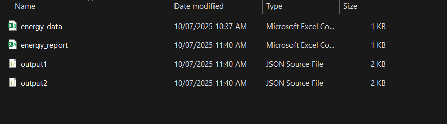

# WP 3.2 - Handover Document

## Stage 3: End-to-End Integration Test

### Objective:
To verify that the WP 3.2 orchestrator can successfully execute and manage the complete WP 3.1 pipeline using configuration-driven commands.

### Actions Taken:
- Ensured WP 3.1 repository containers were working and built.
- Generated a new `energy_data.csv` file with valid synthetic data.
- Launched the orchestrator using:
  ```bash
  docker-compose run --rm orchestrator python main.py
  ```
- Observed sequential execution:
  - `energy-generator` ran and created `energy_data.csv`
  - `energy-analyzer` ran and created `output1.json`
  - `report-generator` ran and created `output2.json` and final `energy_report.csv`
- Verified correctness of each intermediate and final output.
- Confirmed container logs output expected content.

---

## Stage 3: Execution from 3.1 Orchestrator

### Objective:
To confirm that the orchestrator in WP 3.2 correctly triggers WP 3.1 containers with volume-mounted data handoff.

### Execution:
- Ran orchestrator from `AI-Effect-W3.2/docker/` directory:
  ```bash
  docker-compose run --rm orchestrator python main.py
  ```
- Verified logs step-by-step:
  - `energy-generator`: Generated CSV and saved it under `/data/`
  - `energy-analyzer`: Parsed and transformed the CSV into `output1.json`
  - `report-generator`: Generated final `energy_report.csv`
  - Logs show correct execution and sequencing
- Confirmed outputs in mounted folder:
  - `energy_data.csv`
  - `output1.json`
  - `output2.json`
  - `energy_report.csv`

### Notes:
- Mount path resolved to `/home/work/project/AIEffect-3.1-to-3.2/data`
- Subprocess commands injected volume mounting dynamically in `executor.py`

---

## Limitations

- Communication between components is file-based, not service-based.
- `docker run` is executed from within containers, not using APIs or IPC.
- No health check or fault tolerance implemented.
- No true orchestration engine or scheduler yet.
- Logs are console-based, no structured logs or metrics collected.

---

## Screenshots
- [x] Screenshot of CSV in `/data/`

- [x] Screenshot of command run of main.py

- [x] Screenshot of orchestrator success message / trace


---

## Artifacts in Repo (Mentor Access)

- All source code and Dockerfiles are committed to repo:
  - `src/orchestrator/main.py`
  - `src/orchestrator/config_parser.py`
  - `src/orchestrator/executor.py`
- Config JSON:
  - `config/energy-pipeline.json`
- Data pipeline:
  - `/data/energy_data.csv`
  - `/data/output1.json`
  - `/data/output2.json`
  - `/data/energy_report.csv`
- Run logs available in Teams & documented.
- README contains run instructions.

---

## Learning Summary (By Student)

### What I Learned About Containers:
- How to build and tag multi-service Docker containers.
- How `docker-compose` links volumes and networks.
- How to mount shared data folders and pass outputs between services.

### What Broke and How I Fixed It:
- `docker-compose` volume paths were incorrect – fixed relative path alignment.
- `COPY` instructions in Dockerfiles failed due to bad directory layout – corrected Docker context.
- `data` directory permissions – used `sudo` to generate required files.
- Missing images – handled using `docker build` prior to orchestration.

### What I Understood About Orchestrator Sequencing:
- Parsed the config JSON to extract sequence of execution.
- Used `subprocess.run()` to execute Docker commands serially.
- Verified execution order via logs.
- Ensured dependency containers only run after their inputs are ready.

---

## Ready for Mentor Review
This log summarizes the full integration and handover status of WP 3.2, including verification with WP 3.1 deliverables.

Next step: Begin Iteration 2 with service-to-service orchestration using gRPC & async execution.
