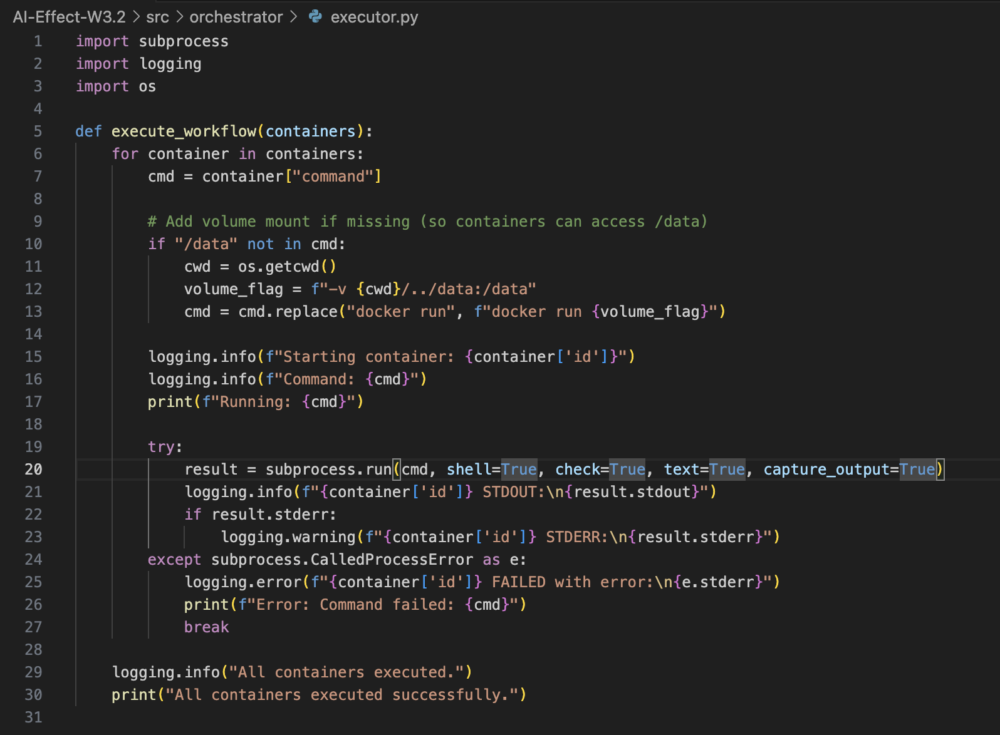
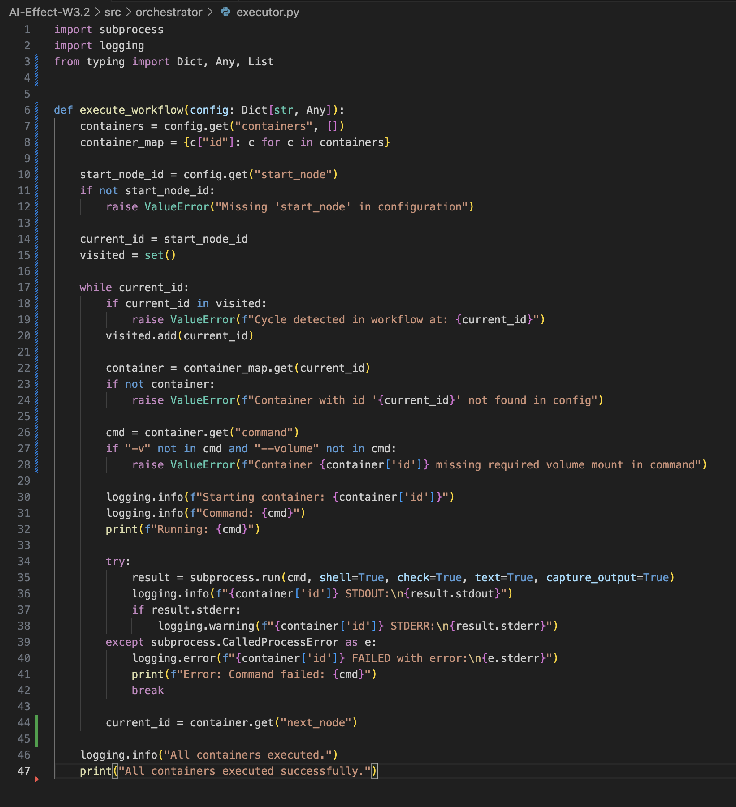
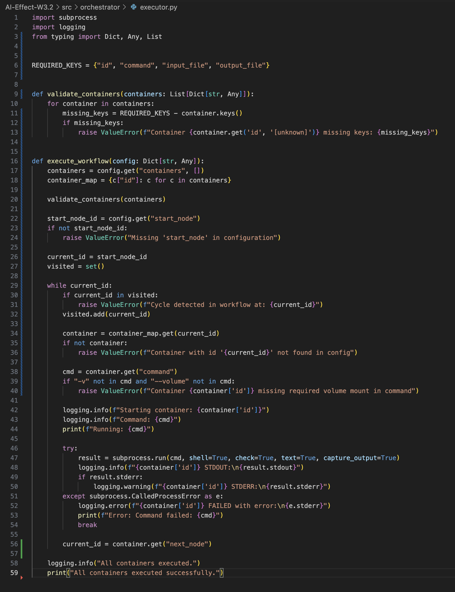
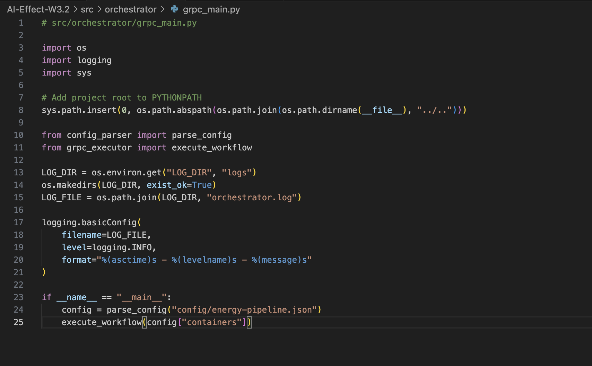
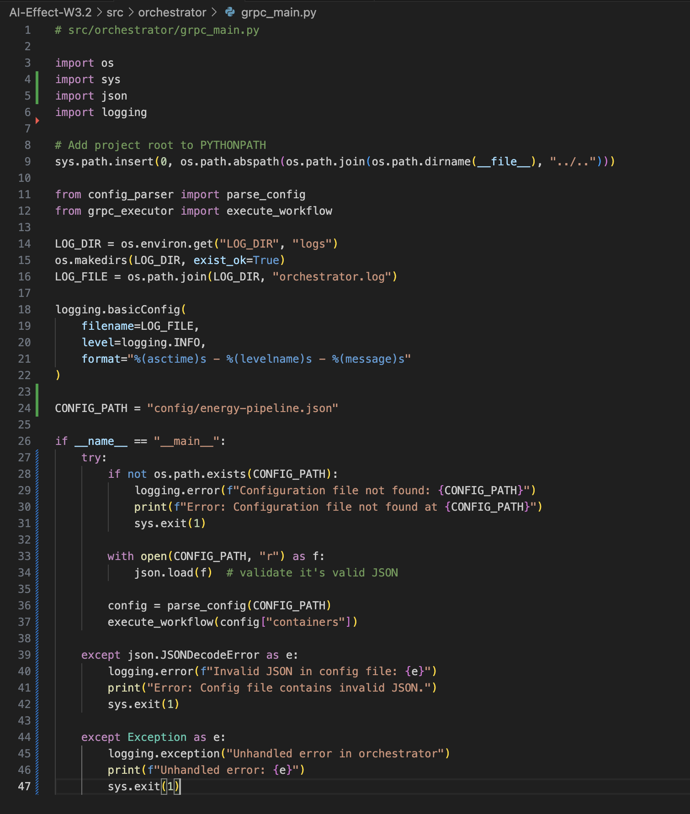

# WP 3.2 - Orchestrator Handover Document

## Final Architecture Summary

This document details the final, working implementation of the WP 3.2 orchestrator. The project successfully transitioned from a Docker-based subprocess executor to a pure gRPC client, fulfilling all Phase 2 requirements.

The final architecture is a service-oriented model where this orchestrator (WP 3.2) acts as the central controller, making gRPC calls to the persistent services provided by WP 3.1.

### Key Features of the Final Implementation:
- **gRPC Client-Only:** The orchestrator does not run Docker commands. It communicates with WP 3.1 services via gRPC.
- **Configuration-Driven Workflow:** The execution flow is determined by `start_node` and `next_node` properties in a central JSON configuration file, not by list order.
- **Dynamic Service Discovery:** The orchestrator connects to the correct WP 3.1 service for each step by looking up its address in the `service_registry`.
- **Robust Validation:** The application validates the configuration on startup and fails fast if required fields are missing or empty, preventing runtime errors.
- **Structured Logging:** All actions are logged to `logs/orchestrator.log`.

---

## How to Run the Orchestrator

**Prerequisites:**
1. The WP 3.1 gRPC services must be running and accessible.
2. A valid `config/energy-pipeline.json` file must be present.
3. A Python virtual environment with the required packages installed.

**Execution Steps:**

1.  **Activate the virtual environment:**
    ```bash
    source .venv/bin/activate
    ```
2.  **Run the main orchestrator script from the project root:**
    ```bash
    python3 src/orchestrator/grpc_main.py
    ```
---

## Key Artifacts in This Repository

- **Main Application Logic:**
  - `src/orchestrator/grpc_main.py`: The entry point for the application.
  - `src/orchestrator/grpc_executor.py`: Contains the core workflow and gRPC client logic.
  - `src/orchestrator/config_parser.py`: Handles loading and validation of the config file.
- **Configuration:**
  - `config/energy-pipeline.json`: The central file defining the workflow, service locations, and file paths.
- **gRPC Contract:**
  - `proto/energy_pipeline.proto`: The human-readable blueprint for gRPC communication.
- **Run Logs:**
  - `logs/orchestrator.log`: Contains detailed logs of the execution flow.

---
---

## WP 3.2 - Appendix: Project Evolution and Historical Log

### Stage 3: End-to-End Integration Test

### Objective:
To verify that the WP 3.2 orchestrator can successfully execute and manage the complete WP 3.1 pipeline using configuration-driven commands.

### Actions Taken:
- Ensured WP 3.1 repository containers were working and built.
- Generated a new `energy_data.csv` file with valid synthetic data.
- Launched the orchestrator using:
  ```bash
  docker-compose run --rm orchestrator python main.py
  ```
- Observed sequential execution:
  - `energy-generator` ran and created `energy_data.csv`
  - `energy-analyzer` ran and created `output1.json`
  - `report-generator` ran and created `output2.json` and final `energy_report.csv`
- Verified correctness of each intermediate and final output.
- Confirmed container logs output expected content.

---

## Stage 3: Execution from 3.1 Orchestrator

### Objective:
To confirm that the orchestrator in WP 3.2 correctly triggers WP 3.1 containers with volume-mounted data handoff.

### Execution:
- Ran orchestrator from `AI-Effect-W3.2/docker/` directory:
  ```bash
  docker-compose run --rm orchestrator python main.py
  ```
- Verified logs step-by-step:
  - `energy-generator`: Generated CSV and saved it under `/data/`
  - `energy-analyzer`: Parsed and transformed the CSV into `output1.json`
  - `report-generator`: Generated final `energy_report.csv`
  - Logs show correct execution and sequencing
- Confirmed outputs in mounted folder:
  - `energy_data.csv`
  - `output1.json`
  - `output2.json`
  - `energy_report.csv`

### Notes:
- Mount path resolved to `/home/work/project/AIEffect-3.1-to-3.2/data`
- Subprocess commands injected volume mounting dynamically in `executor.py`

---

## Limitations

- Communication between components is file-based, not service-based.
- `docker run` is executed from within containers, not using APIs or IPC.
- No health check or fault tolerance implemented.
- No true orchestration engine or scheduler yet.
- Logs are console-based, no structured logs or metrics collected.

---

## Screenshots
- [x] Screenshot of CSV in `/data/`

- [x] Screenshot of command run of main.py

- [x] Screenshot of orchestrator success message / trace


---

## Artifacts in Repo (Mentor Access)

- All source code and Dockerfiles are committed to repo:
  - `src/orchestrator/main.py`
  - `src/orchestrator/config_parser.py`
  - `src/orchestrator/executor.py`
- Config JSON:
  - `config/energy-pipeline.json`
- Data pipeline:
  - `/data/energy_data.csv`
  - `/data/output1.json`
  - `/data/output2.json`
  - `/data/energy_report.csv`
- Run logs available in Teams & documented.
- README contains run instructions.

---

## Learning Summary (By Student)

### What I Learned About Containers:
- How to build and tag multi-service Docker containers.
- How `docker-compose` links volumes and networks.
- How to mount shared data folders and pass outputs between services.

### What Broke and How I Fixed It:
- `docker-compose` volume paths were incorrect – fixed relative path alignment.
- `COPY` instructions in Dockerfiles failed due to bad directory layout – corrected Docker context.
- `data` directory permissions – used `sudo` to generate required files.
- Missing images – handled using `docker build` prior to orchestration.

### What I Understood About Orchestrator Sequencing:
- Parsed the config JSON to extract sequence of execution.
- Used `subprocess.run()` to execute Docker commands serially.
- Verified execution order via logs.
- Ensured dependency containers only run after their inputs are ready.

---

## Ready for Mentor Review
This log summarizes the full integration and handover status of WP 3.2, including verification with WP 3.1 deliverables.

Next step: Begin Iteration 2 with service-to-service orchestration using gRPC & async execution.


---

## Iteration 2: gRPC-based Orchestration Setup

### Objective:
To refactor the WP3.2 orchestrator to use gRPC communication instead of subprocess-based `docker run` calls, enabling a more modular, service-driven architecture.

### Actions Taken:
- Defined a new `.proto` file `energy_pipeline.proto` under `proto/` directory with the following schema:
  ```proto
  syntax = "proto3";

  service ContainerExecutor {
    rpc Execute(ExecuteRequest) returns (ExecuteResponse);
  }

  message ExecuteRequest {
    string input_file = 1;
    string output_file = 2;
  }

  message ExecuteResponse {
    bool success = 1;
    string message = 2;
  }
  ```

- Used `grpc_tools.protoc` to generate two Python modules:
  - `energy_pipeline_pb2.py`
  - `energy_pipeline_pb2_grpc.py`

- Relocated both files into `proto/` and fixed imports using relative syntax (`from . import energy_pipeline_pb2`).

- Implemented `grpc_executor.py` to replace the legacy `executor.py`:
  - Establishes channel with `localhost:50051`
  - Sends serialized request to remote service
  - Logs all responses and errors

- Implemented `dummy_grpc_server.py` to simulate a basic gRPC-compatible backend:
  - Accepts request, validates file paths
  - Returns a success/failure message for testing without running actual containers

- Modified `grpc_main.py` to integrate config parsing and gRPC-driven container dispatch.

- All gRPC orchestrator files were moved to `src/orchestrator/` while keeping proto definitions in `proto/`.

### Outcome:
- gRPC communication between orchestrator and dummy backend confirmed.
- Correct logging and file path transfer observed.
- The structure allows drop-in replacement of dummy server with actual container gRPC services in future iterations.

---

## Screenshots – Iteration 2

- [x] gRPC Protobuf Structure Setup  
  

- [x] Dummy gRPC Server Validation  
  

---

## Next Steps

- Replace dummy backend with actual container-based gRPC handlers.
- Run end-to-end tests by invoking real containers through gRPC interface.
- Compare performance and logging between subprocess vs. gRPC execution.

---

## gRPC Local Testing on macOS – July 12

### Objective:
Verify gRPC-based orchestrator behavior on a clean machine (macOS) using the dummy gRPC server.

### Actions Taken:
- Cloned the `AI-Effect-W3.2` repo onto a fresh macOS setup.
- Installed required tools and Python dependencies.
- Set up Python virtual environment and activated it.
- Fixed path issues in `grpc_executor.py` and `grpc_main.py`.
- Regenerated protobuf files using:
  ```bash
  python3 -m grpc_tools.protoc -Iproto --python_out=proto --grpc_python_out=proto proto/energy_pipeline.proto
  ```
- Successfully ran `dummy_grpc_server.py`.
- Launched `grpc_main.py` and confirmed gRPC call flow for 3 containers using the dummy backend.
- All logs showed expected results with correct request/response behavior.

### Outcome:
- Verified full orchestrator execution via gRPC on a non-Linux host.
- Logging, protobuf, and client/server communication fully functional.

### Screenshots:
- [x] gRPC Dummy Client Execution  
  

- [x] gRPC Container Execution Simulated via Dummy Server  
  

## Critical Fixes – Phase 2 Week 1

### Decision: Fail-Fast Over Silent Recovery

We decided to fail early when configuration or container setup is invalid rather than silently applying default or fallback logic.

This avoids:
- Hidden bugs caused by silently patched configuration
- Assumptions around paths (e.g., `/data`) being hardcoded
- Poor debugging experience later in testing or production

---

### Fix 1: Removed volume-mount auto-patching in `executor.py`

**Old behavior**:
- If container command didn’t have a `-v` volume mount, the code injected it automatically

**New behavior**:
- Raises `ValueError` if volume mount is missing, enforcing correct JSON config structure

Before:  


After:  


---

### Fix 2: Execution flow updated to respect `next_node` instead of list order

**Old behavior**:
- Iterated over containers in list order, ignoring dependencies

**New behavior**:
- Traverses from `start_node` using `next_node` links
- Prevents incorrect execution order and adds cycle detection

After Fix 3:  


---

### Fix 3: Replaced hardcoded gRPC paths with config-passed paths

**Old**:
- gRPC request always sent `/data/<file>` for input/output

**New**:
- gRPC now accepts full paths from `input_file` and `output_file` fields in the config

---

### Fix 4: Applied logging and import fixes in `grpc_main.py`

- Ensured graceful handling of missing config paths
- Clean logging setup using `LOG_DIR` env var
- Removed assumptions about default working dir

Before:  


After:  



